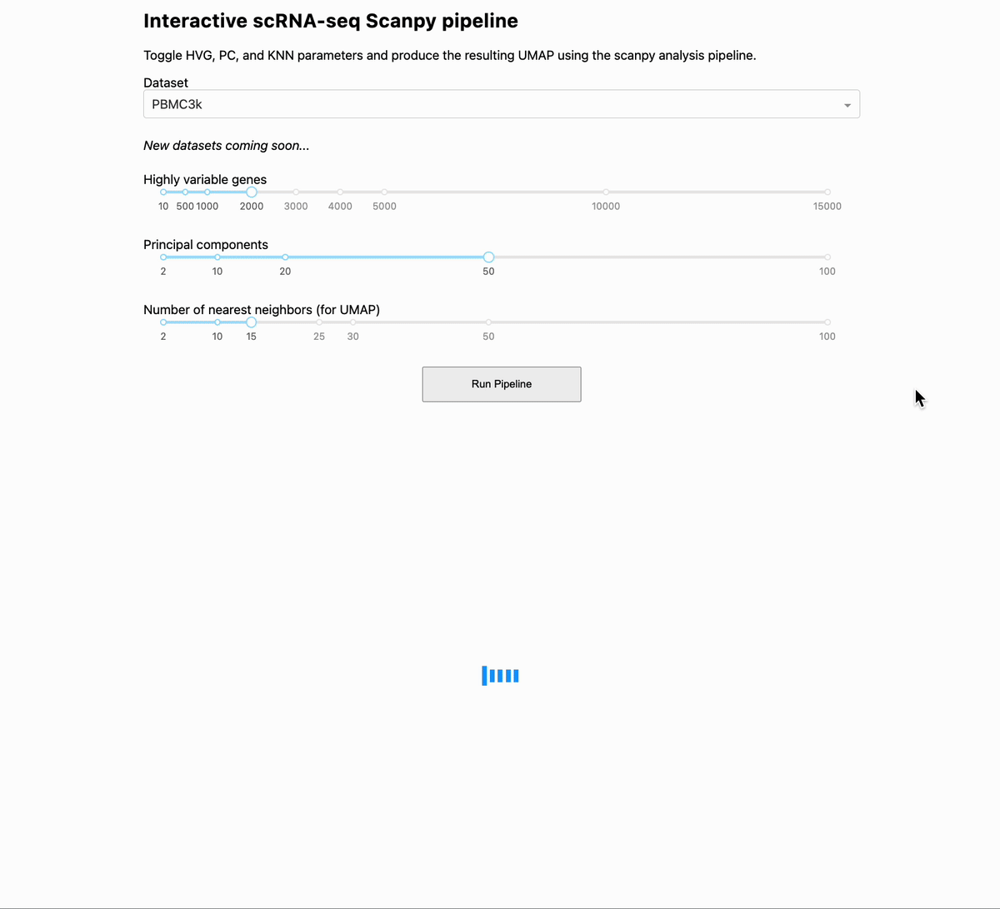

# Interactive scanpy pipeline

## What this is
Interactive app that allows the user to run a single-cell sequencing analysis pipeline, varying various parameters to determine how this affects downstream output. The purpose of this is for the user to gain (if not speedrun) intuition around the various aspects of an analysis pipeline.

An example of its use can be found here (gif is sped up 3x):



## Installation
Create a directory of interest where you want this project to sit. Then using the command line, follow the instructions below.

```bash
# clone
git clone https://github.com/ariannaaalami/interactive_scanpy_pipeline.git
cd interactive_scanpy_pipeline

# create and activate a virtual env
python3 -m venv .venv
source .venv/bin/activate   # macOS/Linux

# if Windows (PowerShell): 
.\.venv\Scripts\Activate.ps1

# install required packages
pip install -r requirements.txt

# run
python proto_interactive_scanpy.py
```
Then, open the printed URL (e.g., http://127.0.0.1:8050)

## Components of the pipeline
This pipeline adheres to the standard best practices of single-cell RNA sequencing analysis. It uses scanpy as the workhorse. It takes the data, normalizes it, does log1p (log(data + 1)), finds the top n highly variable genes, scales the data, does PCA, makes a KNN graph, and runs UMAP. The annotated cells displayed are pre-made outside of this pipeline, which helps the user ascertain how changing the setting affects what was otherwise done under "optimal" settings.

## What you can change (in current version)
- Datasets: PBMC3k and dentate gyrus neurogenesis.
- Highly variable genes (default: 2000)
- Number of principal components (PCs) used for downstream analysis (default: 50)
- Number of nearest neighbors (default: 15)

## Output
The app will give you a UMAP that is colored by pre-made cell annotations. 


